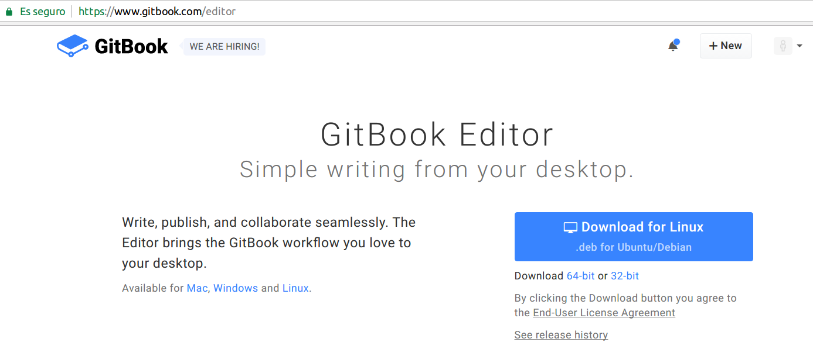
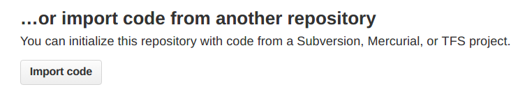
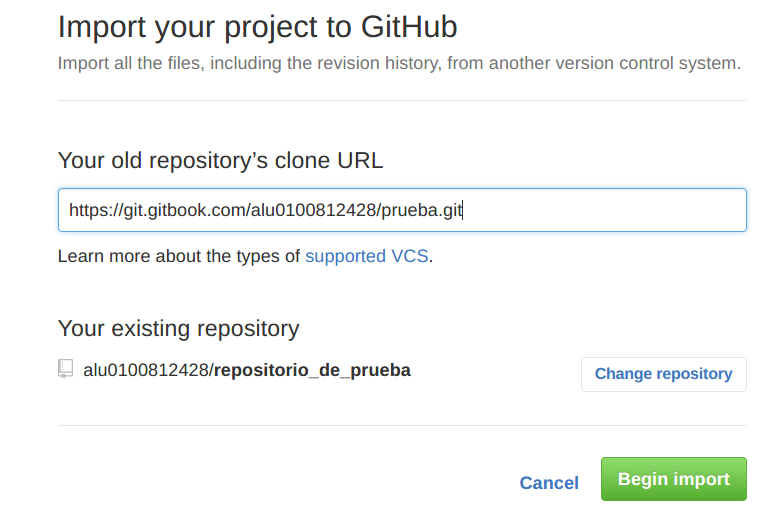
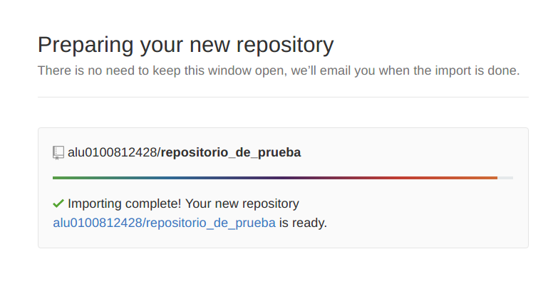

#Capítulo 1: GitBook
##1.1 ¿Qué es GitBook?
[**Gitbook**](https://www.gitbook.com) es una herramienta online para utilizar desde el navegador que nos permite crear libros y documentos utilizando sintaxis Markdown o AsciiDoc. Estos libros una vez creados, pueden ser visualizados en web, o pueden ser exportados como e-book o pdf. Tiene disponible una versión una versión de escritorio llamada gitbook Desktop y una versión web.

##1.2 ¿Cómo usar GitBook?
En primer lugar, debemos crear una cuenta de usuario, y ya podemos empezar a utilizar la versión para el navegador web. Para la versión GitBook Desktop, debemos descargar e instalar el programa desde [esta página](https://www.gitbook.com/editor) e iniciar sesión.

En esta versión se pueden utilizar libros guardados de manera local o los que tengamos asociados a nuestra cuenta de Gitbook.

##1.3 Importar libros desde Gitbook a un repositorio Github
* Para poder importar un libro desde Gitbook a un repositorio de Github, debemos tener un repositorio vacío en Github y seleccionar la opción import code.

* Luego, vamos a nuestro libro de Gitbook y entramos en settings. Presionamos en la flecha que está a la derecha del botón edit y nos mostrará la dirección git de nuestro libro.

* Lo copiamos y lo ponemos en la ventana que teníamos inicialmente de Github y le damos a Begin import.

* Esperamos a que termine de prepararse el repositorio.

* Y listo. Ahora tendremos tanto Gitbook y Github sincronizados.

