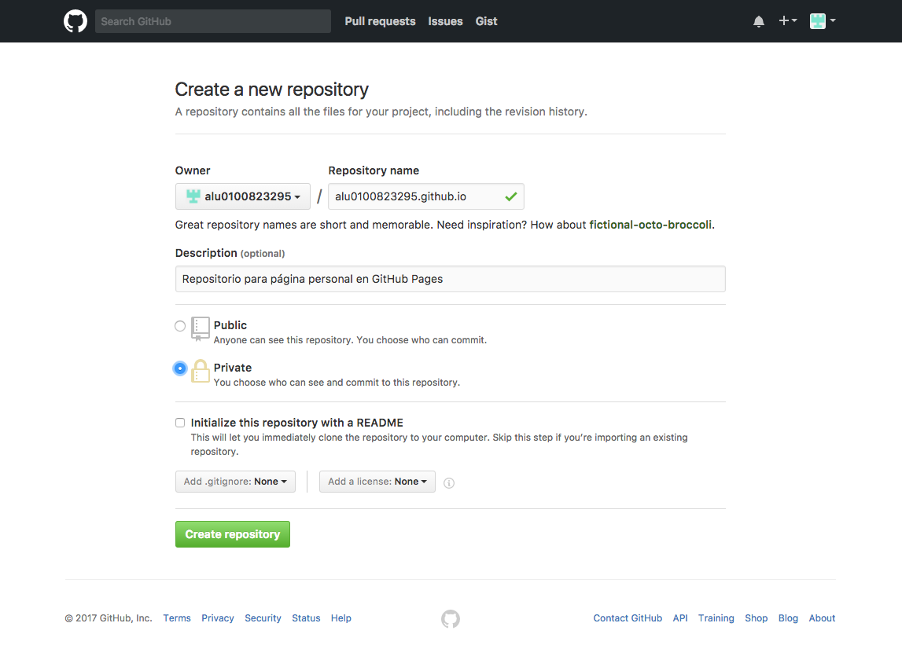
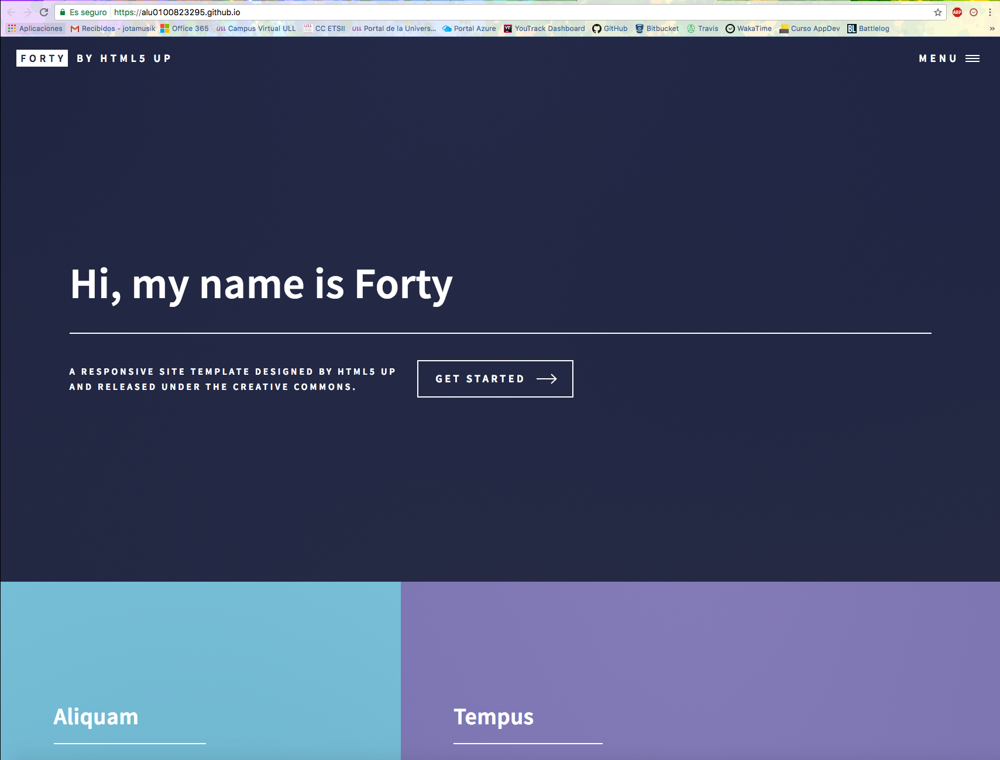

# Capítulo 2: GitHub Pages

## 3.1 ¿Qué es GitHub Pages?

[**GitHub Pages**](https://pages.github.com/) es el servicio de almacenamiento y publicación de páginas web que pone a nuestra disposición _GitHub_. Este servicio nos da la posibilidad de poder crear tres tipos de páginas web:

1. Página personal de usuario. Esta será una web que nos represente en GitHub como usuario y persona.
2. Página de organización. Esta será la página web que respresente a la organización a la que pertenezca
3. Página de proyecto. Página que represente al proyecto al que pertenezca.

## 3.2 ¿Cómo usar GitHub Pages?

### 3.2.1 Página personal

1. Lo primero que haremos es crear un nuevo repositorio con el nombre: ***<nombre-usuario>.github.io***

2. Una vez creado el repositorio, lo que debemos hacer es un _push_ del código al repositorio.

 
3. Automáticamente una vez hecho el _push_ podremos acceder a la página web a través de la URL: ***https://<nombre-usuario>.github.io***

_**Nota:** El código usado en este ejemplo es una plantilla gratuita disponible en [HTML5 UP](https://html5up.net/)_

### 3.2.2 Página de organización

Deberemos seguir los pasos descritos para la página personal con las siguientes diferencias:

* El repositorio que debemos crear debe ser de la organización ha de tener el nombre: ***<nombre-organizacion>.github.io***
* La página web desplegada estará disponible en la URL: ***https://<nombre-organizacion>.github.io***

### 3.2.3 Página de proyecto

1. En el repositorio del proyecto que queramos desplegar la página creamos una rama que se llame ___gh-pages___.

2. Hacemos **push** a dicha rama del código de la página.

3. Nos aseguramos de que en la configuración del repositorio tenemos activado el servicio de GitHub Pages para la rama anteriormente especificada.

4. Una vez realizados todos los pasos, podremos acceder a la página del proyecto desde la URL:  
***https://<nombre-usuario/nombre-organizacion>.github.io/<nombre-repositorio>***

_**Nota:** Las páginas de proyectos pueden tener distinta "fuente", es decir, no solo se puede publicar el código desde la rama **gh-pages** 
sino que se puede cambiar la configuración para que el código este en la rama **master** bajo el directorio **/docs**, o también en la propia 
rama **master**._  

---

___A modo de resumen:___  
