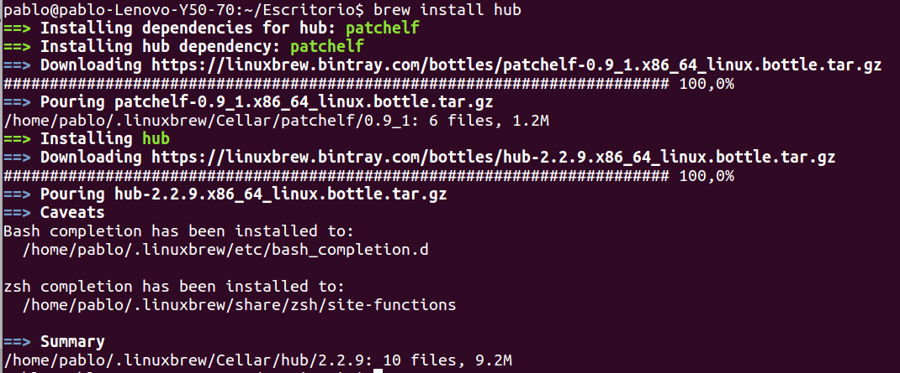
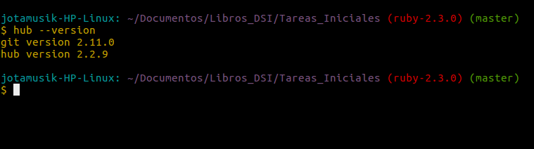

# Capítulo 6: Hub

## 3.1 ¿Qué es Hub?

[**Hub**](https://github.com/github/hub) es una utilidad que está diseñada para facilitar la tarea de trabajar con repositorios remotos, más en concreto, con GitHub permitiendonos acceder a nuestros repositorios con el nombre de usuario y el nombre del repositorio. De esta manera podremos acceder a un repositorio tal que:

```
hub clone <nombre-usu>/<nombre-repositorio>
```

## 3.2 ¿Cómo instalar Hub?

Se puede instalar esta utilidad de diversas maneras. A continuación se detallará la que nosotros consideramos la manera más sencilla de hacerlo. 
Lo primero que deberemos hacer es instalar el gestor de paquetes **Homebrew**:

```
sudo apt-get install linuxbrew-wrapper
```

Una vez hecho esto procederemos a instalar **hub**:

```
brew install hub
```

  

_tras haber ejecutado este último comando ya tendremos instalado **hub**
podremos comprobarlo haciendo `hub --version` y nos saldrá algo como esto:_




## 3.3 ¿Cómo utilizar Hub?

**Hub** es una expansión del comando `git`, por lo tanto podemos hacer uso de todos aquellas opciones que el comando `git` nos permitía. Básicamente podremos sustituir `git` por `hub`cuando estemos haciendo uso de la terminal.
Por ejemplo:

```
git commit
```
_es equivalente a:_

```
hub commit
```

**Hub** no solo nos permite acceder a nuestros repositorios de GitHub, sino que también nos permite crear un repositorio desde la terminal:

```
hub create <nombre-usuario>/<nombre-repo>
```

También podremos abrir un repositorio en el navegador desde la terminal. Para ello ejecutaremos:

```
hub browse <nombre-usuario>/<nombre-repo>
```
_de esta manera se nos abrirá automaticamente nuestro navegador y nos aparecerá el repositorio en GitHub que le hemos especificado_