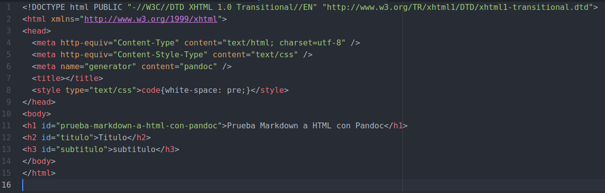
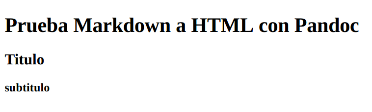

# Capítulo 7: Pandoc
##7.1 ¿Qué es Pandoc?
[**Pandoc**](http://pandoc.org/) es un conversor de documentos libre y de código abierto. Nos permitirá convertir ficheros escritos en un lenguaje de marcado como Markdown a HTML, ReStructuredText, LaTeX, OPML, Org-mode, DocBook, y Office Open XML (Microsoft Word .docx).
##7.2 ¿Cómo instalar Pandoc?
Teniendo ya instalado [Node.js](/cap3/nodejs.md), introducimos el siguiente código en la terminal.
`sudo npm install node-pandoc --save`

##7.3 Ejemplo de uso de Pandoc
Creamos un archivo llamado prueba.md con el siguiente código markdown.

```
#Prueba Markdown a HTML con Pandoc

##Titulo

###subtitulo
```
Y escrbimos el siguiente código en la terminal

`pandoc intro.md -f markdown -t html -s -o prueba.html`


* -f markdown para indicar que el fichero de origin está escrito en markdown.

* -t html para indicar que la salida se escriba en HTML.

* -s Para que la salida tenga un header y footer apropiado.

* -o prueba.html para que se guarde en dicho fichero la salida.

El fichero de salidad contiene el siguiente código.  



Y al abrir en el navegador se ve de la siguiente manera.


